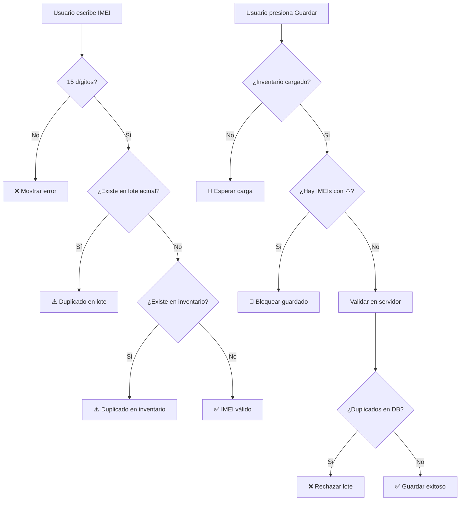

# 🛡️ Sistema de Validación de IMEI Duplicados

## 📋 Descripción General

Este sistema implementa una **validación robusta en múltiples capas** para prevenir el ingreso de equipos con IMEI duplicados al inventario.

## 🔐 Capas de Seguridad

### **Capa 1: Validación en Tiempo Real (Cliente)**
- ✅ Validación instantánea mientras el usuario escribe el IMEI
- ⚠️ Icono de advertencia visual cuando detecta duplicado
- 🎨 Resaltado del campo con borde naranja
- 💡 Tooltip informativo con detalles del equipo existente
- 🔄 Re-validación automática al eliminar filas

**Archivo:** `public/ingreso-mercancia.html`

**Función clave:**
```javascript
function verificarImeiDuplicado(imei, filaActual) {
    // Verifica contra otras filas del lote actual
    // Verifica contra el inventario existente
    // Retorna información detallada del duplicado
}
```

### **Capa 2: Validación Pre-Guardado (Cliente)**
- 🚫 Bloquea el botón de guardar si detecta IMEIs duplicados
- 📊 Muestra conteo de advertencias en el resumen
- 🎯 Indica exactamente qué filas tienen problemas

**Archivo:** `public/ingreso-mercancia.html`

**Validación en botón guardar:**
```javascript
// Verificar si hay IMEIs con advertencias
const imeisDuplicados = Array.from(tablaBody.querySelectorAll('.campo-imei.imei-duplicado'));
if (imeisDuplicados.length > 0) {
    showToast('⚠️ Hay IMEIs duplicados. Corrígelos antes de guardar.', 'error');
    return;
}
```

### **Capa 3: Validación Servidor (Backend)**
- ⏳ **Espera sincronización:** No permite guardar hasta que el inventario esté cargado
- 🔍 Valida IMEIs duplicados **dentro del mismo lote**
- 🗄️ Valida IMEIs que **ya existen en el inventario**
- 📝 Retorna mensajes detallados con fila, IMEI, modelo y estado

**Archivo:** `public/js/services/InventarioService.js`

**Método clave:**
```javascript
async guardarLote(equiposArray, origenLote = "") {
    // ⚠️ VALIDACIÓN CRÍTICA: Esperar sincronización
    if (!this._inventarioListo) {
        await this.esperarListo();
    }
    
    // Validación 1: Duplicados en el mismo lote
    // Validación 2: Duplicados en el inventario
    // Retorna error detallado si encuentra duplicados
}
```

## 🎯 Indicadores Visuales

| Estado | Icono | Color | Significado |
|--------|-------|-------|-------------|
| **Válido** | ✅ | Verde | IMEI de 15 dígitos, único |
| **Incompleto** | ❌ | Rojo | Faltan dígitos |
| **Duplicado** | ⚠️ | Naranja | Ya existe en inventario o lote |

## 🔄 Flujo de Validación



## 🚀 Mejoras Implementadas

### 1. **Sincronización Garantizada**
```javascript
// Promise que se resuelve cuando el inventario está listo
async esperarListo() {
    if (this._inventarioListo) return true;
    await this._readyPromise;
    return true;
}
```

### 2. **Bloqueo de Botón**
```javascript
// El botón permanece deshabilitado hasta que el inventario esté sincronizado
btnGuardar.disabled = true;
btnGuardar.textContent = '⏳ Cargando inventario...';

await inventarioService.esperarListo();
btnGuardar.disabled = false;
```

### 3. **Re-validación Automática**
```javascript
// Al eliminar una fila, re-valida todos los IMEIs
function revalidarTodosLosImeis() {
    const filas = tablaBody.querySelectorAll('tr');
    filas.forEach(tr => {
        const imeiInput = tr.querySelector('.campo-imei');
        if (imeiInput && imeiInput.value.length === 15) {
            imeiInput.dispatchEvent(new Event('input'));
        }
    });
}
```

## 🐛 Problema Original

**Síntoma:** Se podían guardar equipos con IMEI duplicado al abrir la página por primera vez.

**Causa raíz:** El caché del inventario (`_cacheInventario`) se cargaba de forma asíncrona, pero la validación se ejecutaba inmediatamente. Si el usuario guardaba antes de que terminara la sincronización, el array estaba vacío y la validación no detectaba duplicados.

**Solución:** Implementar sistema de promesas que bloquea el botón de guardar hasta que la sincronización esté completa.

## ✅ Testing Manual

Para probar el sistema:

1. **Test 1 - Duplicado en lote:**
   - Agrega dos filas
   - Usa el mismo IMEI en ambas
   - ✅ Debe mostrar ⚠️ en ambas

2. **Test 2 - Duplicado en inventario:**
   - Copia un IMEI del inventario existente
   - Intenta ingresarlo
   - ✅ Debe mostrar ⚠️ con info del equipo

3. **Test 3 - Carga inicial:**
   - Recarga la página
   - ✅ Botón debe mostrar "⏳ Cargando..."
   - ✅ Se debe habilitar cuando termine la carga

4. **Test 4 - Eliminación de fila:**
   - Crea dos filas con IMEI duplicado
   - Elimina una
   - ✅ La otra debe volver a ✅

## 📊 Métricas de Robustez

- ✅ **3 capas de validación** independientes
- ✅ **Validación en tiempo real** (< 50ms)
- ✅ **Sincronización garantizada** antes de guardar
- ✅ **Re-validación automática** en cambios
- ✅ **Mensajes detallados** de error
- ✅ **Prevención de doble submit** con `_imeisRecienIngresados`

## 🛠️ Mantenimiento

### Archivos críticos:
- `public/ingreso-mercancia.html` - UI y validación cliente
- `public/js/services/InventarioService.js` - Validación servidor
- `public/js/models/EquipoInventario.js` - Modelo de datos

### Logs importantes:
```
✅ Inventario sincronizado: X equipos
✅ Inventario listo para validaciones en tiempo real
⚠️ Esperando sincronización del inventario...
❌ IMEIs ya existen en el inventario: ...
```

## 🎓 Notas del Desarrollador

Este sistema sigue el principio de **defensa en profundidad**: múltiples capas de seguridad que se validan entre sí. Si una capa falla, las otras capturan el error.

La validación en tiempo real mejora la UX, pero la validación en servidor es la que garantiza la integridad de los datos.
